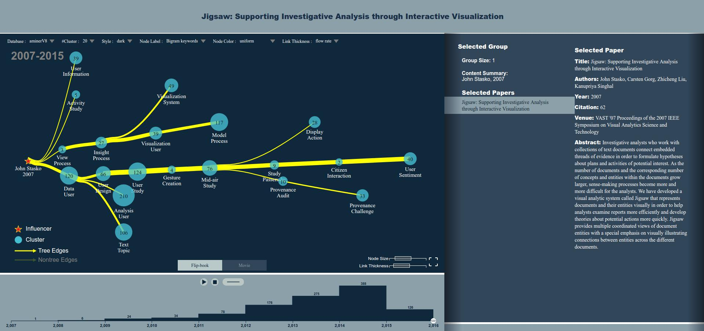
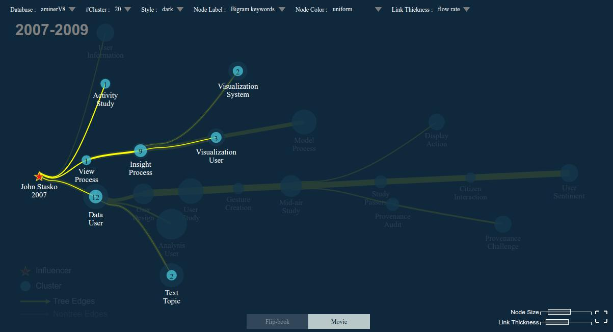

# eiffel-web

本部分文档只记录了代码阅读笔记、新需求梳理以及现有思路三个部分。

## 目录

1. 代码阅读
2. 需求梳理
3. 思路介绍

----

## 一、代码阅读

阅读的代码均为新添加需求所涉及的部分。

### 1. init.js

整个 JavaScript 文件过长，初始化入口如下所示，已经添加了个人理解注释，供参考：

```javascript
function initLayout() {
    initServer(); // 找不到
    initVariable(); // 初始化参数？
    initVenueList(); // 找不到
    initSetting(colorStyle); // 貌似所有的界面绘制都在这？
    initFullScreenAndSizeBar(); // ？
    gTranslation(); // ？
    drawFullScreenIcon(gFullScreen, fullScreenButtonTranWidth, fullScreenButtonTranHeight); // ？
    //    initRightClickMenu();

    //    $(window).on('resize',initSetting);
    requestData(); // 找不到

}
```

除此外，在代码里看到的 leftLayer 指的就是页面主视图的 layer.

*注意：很多地方使用的是全局变量，难以找到初始定义的位置，这个会提高代码阅读的困难，请格外注意。*

### 2. dist 目录下文件

关于 `/dist/main-xxxx.js` 上万行的代码， `dist` 文件夹内的js文件全都是打包过的，在运行graph_origin.html的时候完全不需要dist内的文件，所以本地开发的时候可以把dist清掉，就不会被干扰到了。

*注意：实际页面使用的是 graph.html 文件，但是作者描述为 graph_origin.html 文件，所以该地方在开发前需要进一步确认。*

### 其余文件解释

该部分注释整理自作者描述，具体可联系 <suyue0731@gmail.com>.

#### request_new.js

解析url参数，从服务器获取数据，进行页面渲染。这个文件中能看到很多段下面的代码，以前有种incremental的布局方式，现在应该都不用了，实际代码走的都是else分支。

```
item.layer.processData(tmpData);
if (item.layer.focusedID && item.layer.preFocusedID) {
    item.layer.layout(optionNumber, true, 'incremental', item.layer.data.postData[item.layer.focusedID]);
} else {
    item.layer.preLayout(item.layer.data.postData[item.layer.focusedID]);
}
```

#### processData.js

上段代码中调用的processData是整个系统中负责处理数据部分，这里用了大量
的代码对数据进行预处理，布局：

```
if (this.method != 'origin') {
    this.linkPruning();
}
```

这里实现了一个剪枝算法，把原始图中过多的边剪掉，具体可以看论文：

```
var newGraph = new Graph(this.data.postData[this.focusedID].edge, assistEdge);
this.reCalculateLayout(newGraph, this.data.postData[this.focusedID]);
```

这段代码调用内嵌的js版graphViz对图进行一个初始布局

```
reverseXY(this.data.postData[this.focusedID]);
```

graphViz生成的图方向是从上而下，这里将其反转到从左到右

```
this.coordinateOffset(this.data.postData[this.focusedID]);
```

对坐标进行一些微调，不用太关注

```
this.calculateFlowMap(this.data.postData[this.focusedID]);
```

计算flowMap的布局，这里代码比较复杂，改动时要慎重

```
this.temporalSummarization(this.data.postData[this.focusedID]);
```

在时间纬度上对图进行处理，实际效果不是很好，最后这里生成的数据应该没有用，而是在布局时根据case写死

```
this.setInitNodeTransition(this.data.postData[this.focusedID]);
this.setInitEdgeTransition(this.data.postData[this.focusedID]);
```

初始化动画所需要的一些参数

```
this.getRelation(this.data.postData[this.focusedID]);
```

初始化节点和边之间的关系

```
getCurves(this.data.postData[this.focusedID]);
```

初始化边的数据

```
if (this.focusedID && this.preFocusedID) {
    var fID = parseInt(this.focusedID.split('_')[1]);
     var pID = parseInt(this.preFocusedID.split('_')[1]);
     if (fID > pID) {
         generateTransitionData(this.data.postData[this.focusedID], this.data.postData[this.preFocusedID]);
     }
     else if (fID < pID) {
         generateTransitionData(this.data.postData[this.preFocusedID], this.data.postData[this.focusedID]);
     }
 }
```

代码中涉及到需要focusedId & preFocusedId的地方应该都不需要了

```
function preLayout(d) {
    var layoutData = {};
    clone(d, layoutData);
    //渲染底部坐标轴以及动画控制面板
    this.axisLayout(d);
    this.yearFilter = [this.minYear, this.maxYear];
    this.preYear = this.minYear;
    //这个方法比较关键，根据年份对节点和边的动画进行初始化设置
    var newD = this.filterDataByYear(d, [this.yearFilter[0], this.yearFilter[1]]);
    //渲染
    this.layout(optionNumber, false, false, newD);
    this.ifInitLayout = false;
    this.requestTitleList(this.focusedNodeData, 300);
}
```

这个方法会在request_new中，processData结束时调用，对页面进行渲染

## 二、需求梳理

### 需求总结

三处待修改工作分别为：

1. 根据 citation/reference 过滤节点
2. 根据 cluster 个数过滤节点
3. 右栏详情页调整（指用户点击左边layer具体节点后，在右栏显示的内容）

注意：由于论文修改后重新投稿时，截图或者视频录制实际使用页面为 `<http://IP/eiffel/graph.html?aminerV8_id=1182989&citeseerx_id=9629297&selected=aminerV8&source=aminerV8_citeseerx_&r=111847291>`，所以实际实现效果与开发也以这个页面为主。现行服务器 IP 为 <118.190.210.193>，此处根据实际情况替换本地或云服务器 IP 信息。

### 详细描述

现在的界面如 [图1](./assets/pic1.png) 所示，左边主界面右下角有两个调整按钮分别是 node size 和 Link Thickness，现在最主要的一个修改是需要在这个地方添加类似的控制 bar ——过滤 bar，即通过具体 citations 的数量把不符合条件的文章过滤掉。


<center>图1</center>

其中过滤掉的节点与边不需要完全删除，而是像 movie 按钮按过之后的效果那样做淡化处理，具体如 [图2](./assets/pic2.png) 所示。


<center>图2</center>

另外两个需求，过滤功能与上述第一个功能实现效果一致，另一个涉及右栏调整的需求实现上较为简单，以具体开发和讨论时需求为准。修改界面位置对应 [图3](./assets/pic3.png)。


<center>图3</center>

## 三、思路介绍

### 整体思路概述

关于过滤功能的实现思路，结合作者的描述，整理如下：

> 首先是右下角过滤按钮的画法，init.js 里有个函数叫 initFullScreenAndSizeBar，右下角原本的两个过滤滑块就是在这里画的，用了 d3 的 brush 组件，就是创建一个按钮然后绑定一个滑动时的回调，比如说 edgeBrushed 就是先拿到滑动的范围值，然后调整 emin 和 emax 这两个全局变量的大小，然后重新渲染页面，渲染时会读取这两个全局变量的值来计算边的粗细。
> 
> 实际上你需要实现的部分一个是节点的过滤，这里你在滑动的回调里把数据按 citation 滤一遍重新渲染即可。
> 
> 其次你需要像 movie 模式那样保留原有的图作为背景，init.js 里有个函数是initFrameIndex，这个函数的作用是根据给定的 index 创建一个新的节点和边的图层，然后在从 flibbook 切到 movie 模式时会调一个 graphLayout.js 的 greyBackground 函数，这个函数里会先画一层蒙版然后调 initFrameIndex。你要做的事情其实有点类似，就是滑动的时候把原来的用蒙层盖在底下，然后在上面画一层新的就ok了。

### 核心函数与全局变量解释

渲染过程中的一些比较关键的函数以及一些全局变量缩写的含义如下所示：

#### 1. graphLayout.js

```
axisLayout

# 初始化动画控制面板
# 初始化底部时间轴

getMulEdgeSourceTargetDic
# 一个工具函数，返回一个map，以边的source和target做key

graphZoom
# 页面缩放时的回调

layout
# 渲染的入口

pathData
# 很重要的一个函数，渲染边的时候会把边的数据传进来生成边的'd'属性的数据
# 现在基本会走curveMonotoneX这个case分支

greyBackground
# 给当前svg加层蒙版，然后创建一层新的画布

removeSVGElements
# 根据flipbook或movie来决定渲染时是否保留之前的元素

getStrokeWidth
# 画边的时候取边的strokeWidth的函数，这里会受optionNumber.edgeThicknessOption这个全局变量的控制

SizeScale
# 节点大小的比例尺函数
```


#### 2. animationControl.js

```
drawAnimateControlPanel
# 初始化动画控制面板的几个按钮

updateAnimation
# 比较重要的一个函数，需要更新动画时会调用这个函数来重新过滤数据并渲染页面

drawEdges
drawNodes
drawLabels
drawSize
# 这几个放一起说了就是字面意思上的渲染边，节点，节点下面的label
# 以及节点正中间的数字
# 渲染时会判断doTransition来判断是否需要做动画
```

#### 3. clickFunction.js

```
nodeClick
# 这个函数是点击节点时触发的回调
# 点击时会动态改变右侧两栏的内容，也会改变底部时间轴的内容
```

#### 4. infoDivEvents.js

```
requestTitleList
# 点击节点时的回调里会调这个方法来拉被点击节点的文章列表

clusterSummary
# 渲染节点摘要

nodeList
# 渲染节点包含的文章列表

nodeValue
# 每篇文章点击时绑定的回调
# 更新最右侧文章具体的题目作者摘要等信息
```

#### 5. controlDivEvents.js

这里基本就是svg上方的控制栏的一些相关函数，不详细介绍

#### 6. dragEvent.js

拖拽事件的回调，这块比较复杂，轻易不要动，应该也不需要动

#### 一些全局变量

一些全局变量解释如下所示，更详细或者开发过程中遇到的问题可以继续询问作者。

```
dMin
dMax
initDMin
initDMax
# 节点的半径最小最大值，初始最小最大值

nodeOpacityMin
nodeOpacityMax
# 节点透明度最小最大值

eMin
eMax
initEMin
initEMax
# 边的strokeWidth最小最大值，初始最小最大值

eDomain
# 边的strokeWidth在缩放时的比例尺定义域
```

### 数据接口说明

关于数据接口，基本都在后端代码的 server.js 中：

```
/InfluenceGraph/
# 根据id获取影响力图

/getCluster/
# 点击节点时获取这个节点的详细信息

/getNode/
# 点击节点内某片文章时获取这片文章的详细信息
```

其中， influenceGraph 这个接口不能确定是否返回节点的 citation 字段，具体开发之前需要再次确认。

### 其余注意事项

现有项目中 master 分支为未改动代码， eiffel-front-end-2018 分支为现行主分支，以上需求计划于改i分支上进行改动。该分支上的 init.js 等文件已经进行过 eslint 格式调整，便于阅读，例如 <https://github.com/visdata/eiffel-web/blob/eiffel-front-end-2018/init/init.js>。实际功能与逻辑代码并未作修改，望周知。
